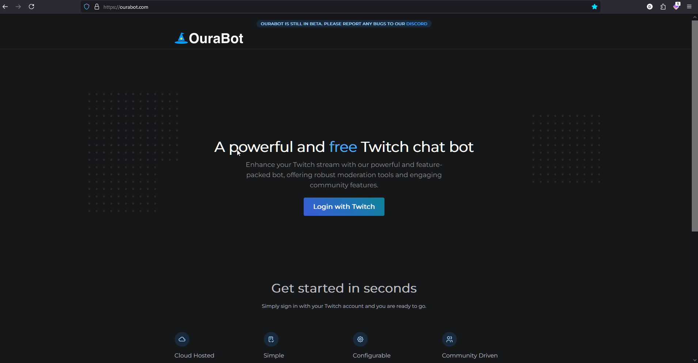
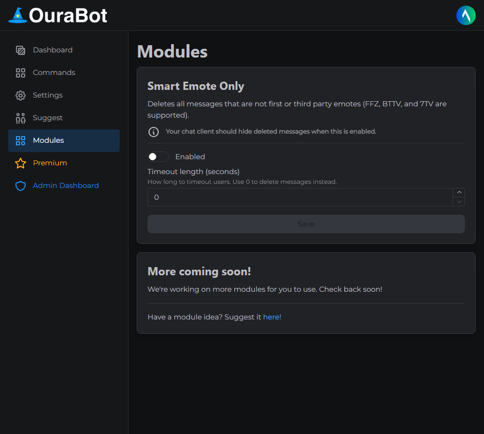
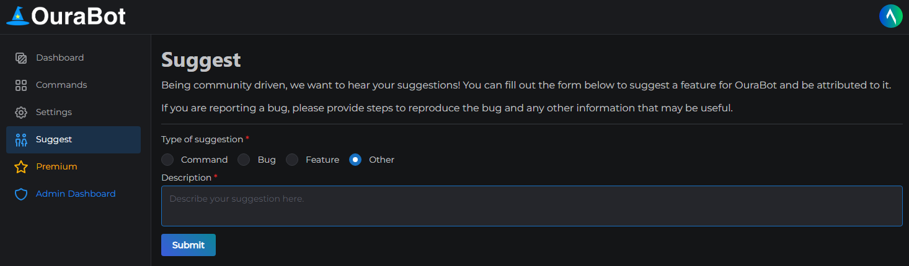
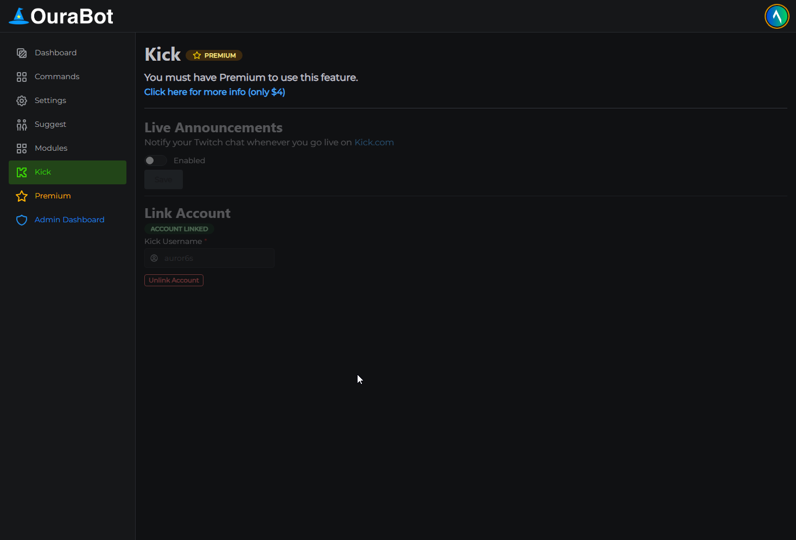

# OuraBot

OuraBot is a powerful Twitch chat bot designed to enhance the streaming experience with advanced moderation tools, custom commands, and integrations. This repository
showcases the bot's architecture, features, and codebase for educational and demonstration purposes.

This project is no longer maintained and the primary domain (ourabot.com) is no longer owned by me.

The codebase is not intended for production use anymore and may contain security vulnerabilities. This repo is provided as-is and does not guarantee functionality or
support. There is no warranty or support provided and the developers are not responsible for any damages incurred while attempting to run the software.

## Features

- Advanced moderation tools for Twitch chat.
- Customizable commands and modules.
- Integration with third-party APIs and services.
- Redis-based event management for real-time communication.
- Modular and extensible architecture.

   

More screenshots coming soon(TM)

## License

This work is licensed under the <a href="https://github.com/ourabot/ourabot/tree/main/LICENSE" target="_blank">Creative Commons Attribution-NonCommercial-ShareAlike 4.0
International License.</a> You are free to share and adapt this work for non-commercial purposes as long as you give appropriate credit and distribute your contributions
under the same license. Commercial licenses may be available upon request. If you have any questions or would like to request a commercial license, please contact the
creator.
